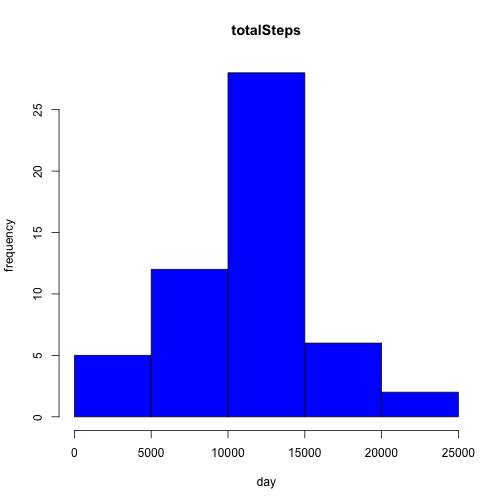
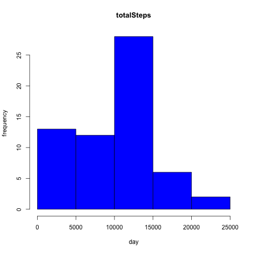
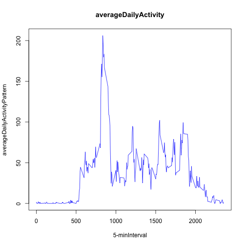
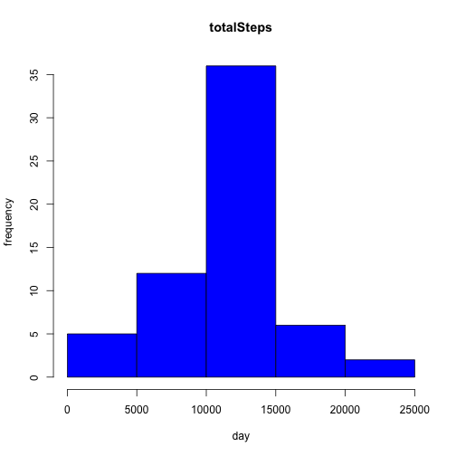
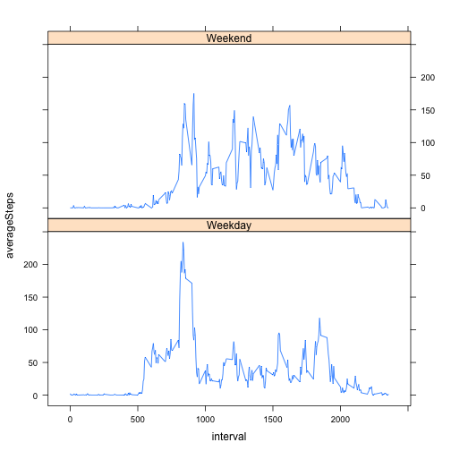

==========================================================
<h2>Loading and preprocessing the data</h2>

```r
# Loading and preprocessing the data
activity <- read.csv("/Users/Creed/Desktop/activity.csv", colClasses = c("numeric", "character", "numeric"))
library(lattice)
activity$date <- as.Date(activity$date, "%Y-%m-%d")
```
<h2>What is mean total number of steps taken per day?</h2>

```r
# What is mean total number of steps taken per day?
StepsTotal <- aggregate(steps ~ date, data = activity, sum, na.rm = TRUE)
hist(StepsTotal$steps, main = "totalSteps", xlab = "day", ylab = "frequency", col = "blue")
```

 

```r
mean(StepsTotal$steps)
```

```
## [1] 10766.19
```

```r
median(StepsTotal$steps)
```

```
## [1] 10765
```

```r
steps <- rep(NA, 61)
day <- rep("NA", 61)
stepsday <- tapply(activity$steps, activity$date, sum, na.rm = TRUE)
length(stepsday)
```

```
## [1] 61
```

```r
for (i in 1:61) {
    steps[i] <- stepsday[[i]]
    day[i] <- names(stepsday)[i]
}
df <- data.frame(day, steps)
head(df)
```

```
##          day steps
## 1 2012-10-01     0
## 2 2012-10-02   126
## 3 2012-10-03 11352
## 4 2012-10-04 12116
## 5 2012-10-05 13294
## 6 2012-10-06 15420
```

```r
hist(df$steps, main = "totalSteps", xlab = "day", ylab = "frequency", col = "blue")
```

 
<h2>What is the average daily activity pattern?</h2>

```r
# What is the average daily activity pattern?
time_series <- tapply(activity$steps, activity$interval, mean, na.rm = TRUE)
plot(row.names(time_series), time_series, type = "l", xlab = "5-minInterval", 
     ylab = "averageDailyActivityPattern", main = "averageDailyActivity", 
     col = "blue")
```

 

```r
max_interval <- which.max(time_series)
names(max_interval)
```

```
## [1] "835"
```
<h2>Imputing missing values</h2>

```r
# Imputing missing values
activity_NA <- sum(is.na(activity))
activity_NA
```

```
## [1] 2304
```

```r
StepsAverage <- aggregate(steps ~ interval, data = activity, FUN = mean)
fillNA <- numeric()
for (i in 1:nrow(activity)) {
    obs <- activity[i, ]
    if (is.na(obs$steps)) {
        steps <- subset(StepsAverage, interval == obs$interval)$steps
    } else {
        steps <- obs$steps
    }
    fillNA <- c(fillNA, steps)
}
new_activity <- activity
new_activity$steps <- fillNA
StepsTotal2 <- aggregate(steps ~ date, data = new_activity, sum, na.rm = TRUE)
hist(StepsTotal2$steps, main = "totalSteps", xlab = "day", ylab = "frequency", col = "blue")
```

 

```r
mean(StepsTotal2$steps)
```

```
## [1] 10766.19
```

```r
median(StepsTotal2$steps)
```

```
## [1] 10766.19
```
<h2>Are there differences in activity patterns between weekdays and weekends?</h2>

```r
# Are there differences in activity patterns between weekdays and weekends?
day <- weekdays(activity$date)
daylevel <- vector()
for (i in 1:nrow(activity)) {
    if (day[i] == "Saturday") {
        daylevel[i] <- "Weekend"
    } else if (day[i] == "Sunday") {
        daylevel[i] <- "Weekend"
    } else {
        daylevel[i] <- "Weekday"
    }
}
activity$daylevel <- daylevel
activity$daylevel <- factor(activity$daylevel)
stepsByDay <- aggregate(steps ~ interval + daylevel, data = activity, mean)
names(stepsByDay) <- c("interval", "daylevel", "steps")
xyplot(steps ~ interval | daylevel, stepsByDay, type = "l", layout = c(1, 2), 
       xlab = "interval", ylab = "averageSteps")
```

 


